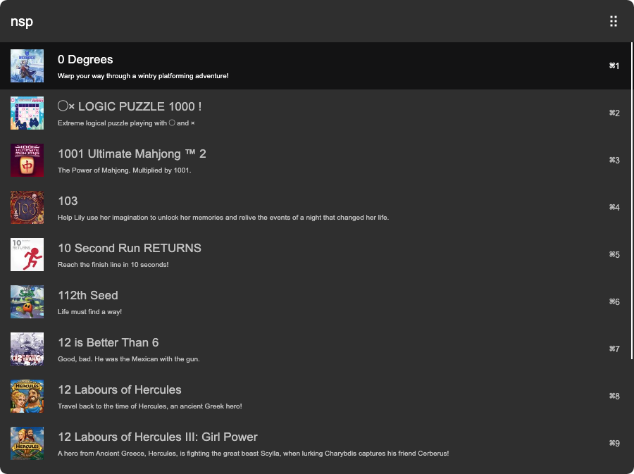

# arvis-nintendo-switch-price-compare

[](http://badge.fury.io/js/arvis-nintendo-switch-price-compare)
[](https://www.npmjs.com/package/arvis-nintendo-switch-price-compare)
[](https://github.com/jopemachine/arvis-nintendo-switch-price-compare/blob/master/LICENSE)
[](http://makeapullrequest.com)
[](https://GitHub.com/jopemachine/arvis-nintendo-switch-price-compare/issues/)

Compare Nintendo Switch game prices by country through https://eshop-prices.com/




## Install

```
$ npm install --global arvis-nintendo-switch-price-compare
```

## Config

You can change `currency` unit in `User Config` table.

Possible `currency` values are as follows.

Default value: `USD`.

| Currency value        | Country               | Currency unit |
|:--------------:|:-----------------------:|:------:|
| ARS          | Argentine Peso        | $    |
| AUD          | Australian Dollar     | $    |
| BGN          | Bulgarian Lev         | лв.  |
| BRL          | Brazilian Real        | R$   |
| CAD          | Canadian Dollar       | $    |
| CHF          | Swiss Franc           | CHF  |
| CLP          | Chilean Peso          | $    |
| CNY          | Chinese Renminbi Yuan | ¥    |
| COP          | Colombian Peso        | $    |
| CZK          | Czech Koruna          | Kč   |
| DKK          | Danish Krone          | kr.  |
| EUR          | Euro                  | €    |
| GBP          | British Pound         | £    |
| GTQ          | Guatemalan Quetzal    | Q    |
| HKD          | Hong Kong Dollar      | $    |
| HRK          | Croatian Kuna         | kn   |
| HUF          | Hungarian Forint      | Ft   |
| IDR          | Indonesian Rupiah     | Rp   |
| ILS          | Israeli New Sheqel    | ₪    |
| INR          | Indian Rupee          | ₹    |
| JPY          | Japanese Yen          | ¥    |
| KRW          | South Korean Won      | ₩    |
| MXN          | Mexican Peso          | $    |
| MYR          | Malaysian Ringgit     | RM   |
| NOK          | Norwegian Krone       | kr   |
| NZD          | New Zealand Dollar    | $    |
| PEN          | Peruvian Sol          | S/   |
| PHP          | Philippine Peso       | ₱    |
| PLN          | Polish Złotyz         | ł    |
| RON          | Romanian Leu          | Lei  |
| RUB          | Russian Ruble         | ₽    |
| SEK          | Swedish Krona         | kr   |
| SGD          | Singapore Dollar      | $    |
| THB          | Thai Baht             | ฿    |
| TRY          | Turkish Lira          | ₺    |
| TWD          | New Taiwan Dollar     | $    |
| UAH          | Ukrainian Hryvnia     | ₴    |
| USD          | United States Dollar  | $    |
| ZAR          | South African Rand    | R    |

## Icon source

https://toppng.com/download-file/2250


